<div align="center">


<br/>


<br/><br/>

[](./LICENSE)
[](https://github.com/ArisaAkiyama/yomic)
[](https://dotnet.microsoft.com/)
[](https://avaloniaui.net/)
[](https://github.com/ArisaAkiyama/extension-yomic)
[](https://github.com/ArisaAkiyama/yomic/releases/latest)
[](https://github.com/ArisaAkiyama/yomic/releases)
[](https://github.com/ArisaAkiyama/yomic)

<br/>

<p align="center">
  <b>Yomic</b> is a free, open-source desktop application for reading manga, manhwa, manhua, and webtoons on Windows.<br/>
  Add sources through extensions, organize your personal library, and read online or offline — with zero ads and maximum performance.
</p>

<br/>

<table>
  <tr>
    <td align="center" width="240">
      <b>📥 Download Here</b><br/><br/>
      <a href="https://github.com/ArisaAkiyama/yomic/releases/download/v1.7.1/Yomic_Setup_v1.7.1.exe">
        
      </a>
    </td>
    <td align="center" width="240">
      <b>☕ Support & Donation</b><br/><br/>
      <a href="https://trakteer.id/Arisa-Akiyama" target="_blank">
        
      </a>
    </td>
    <td align="center" width="240">
      <b>⭐ Support Yomic</b><br/><br/>
      <a href="https://github.com/ArisaAkiyama/yomic/stargazers">
        
      </a>
    </td>
  </tr>
</table>

<p align="center">
  <b>If you enjoy using Yomic, please give the repo a ⭐!</b>
</p>

</div>

---

## 📖 Table of Contents

- [What is Yomic?](#-what-is-yomic)
- [Features](#-features)
- [Screenshots](#-screenshots)
- [Installation](#-installation)
- [Setting Up Extensions](#-setting-up-extensions)
- [Building from Source](#️-building-from-source)
- [Keyboard Shortcuts](#️-keyboard-shortcuts)
- [Contributing](#-contributing)
- [Disclaimer](#-disclaimer)
- [License](#-license)

---

## 🔍 What is Yomic?

Yomic is a centralized manga manager and high-performance reader. Instead of opening multiple browser tabs or navigating different comic websites, Yomic connects to comic repositories using modular extensions. This allows you to search, track, download, and read your favorite series inside a clean, modern desktop interface.

---

## ✨ Features

### ⚡ High-Performance Core Architecture
- **Google Chrome V8 Engine Integration** — Extension scripts execute using native V8 engine binaries (`Microsoft.ClearScript.V8`) for ultra-fast JavaScript parsing.
- **SkiaSharp & SVG Rendering** — Crisp visuals on high-DPI displays (1080p, 2K, 4K, 8K) via `SkiaSharp` and `Avalonia.Svg.Skia`.
- **Instant Binary Serialization** — Library metadata loads instantly with `MemoryPack` binary serialization.
- **Lock-Free Cache & XxHash64** — Concurrent LRU image caching with 10 GB/s non-cryptographic hashing via `BitFaster.Caching` + `XxHash64`.
- **Windows HTTP/2 & Network Resilience** — Native HTTP/2 multiplexing via `WinHttpHandler` with `Polly` exponential backoff retry policies.
- **SQLite WAL Database** — Reading history, library status, and chapter tracking in Write-Ahead Logging mode for maximum data integrity.

### 📚 Library & Organization
- **Virtualized Grid & List View** — Smooth 60 FPS scrolling through thousands of titles via `Avalonia.Controls.ItemsRepeater`.
- **Smart Status Badges** — Visual indicators for unread chapter counts, new releases, downloaded status, and in-library markers.
- **Sorting & Tag Filtering** — Sort by recently read, unread count, or update date; filter by source or status.
- **Backup & Restore** — Back up library database, settings, and cover cache into a `.zip` archive anytime using `SharpZipLib`.

### 🌐 Unlimited Sources (Extensions)
- **Modular Extension Manager** — Browse and install extensions from the online repository in one click.
- **Multi-Language Support** — Access English and Indonesian comic repositories.
- **Cloudflare & Network Tools** — Built-in verification tools and DNS-over-HTTPS (DoH) to bypass network restrictions.

### 📖 Reading Experience
- **Webtoon Mode** — Continuous vertical scrolling with smooth mouse wheel inertia and auto-scrolling.
- **Paged & Dual-Page Mode** — Classic single-page or two-page side-by-side layouts for traditional manga.
- **Background Preloading** — Upcoming pages preloaded automatically for instant chapter transitions.
- **Zoom & Custom Controls** — Fit to width, fit to height, custom zoom multipliers, and page rotation.
- **Fullscreen & Shortcuts** — Full-screen mode (`F11`) with complete keyboard navigation.

---

## 📸 Screenshots

<div align="center">

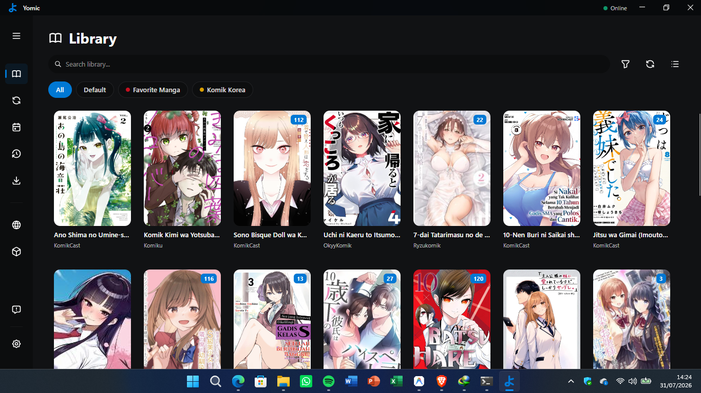
<br/><br/>
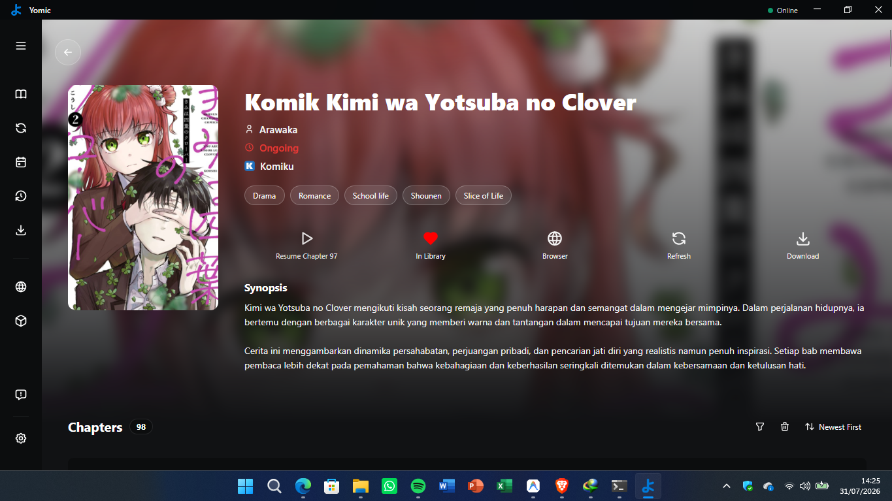
<br/><br/>
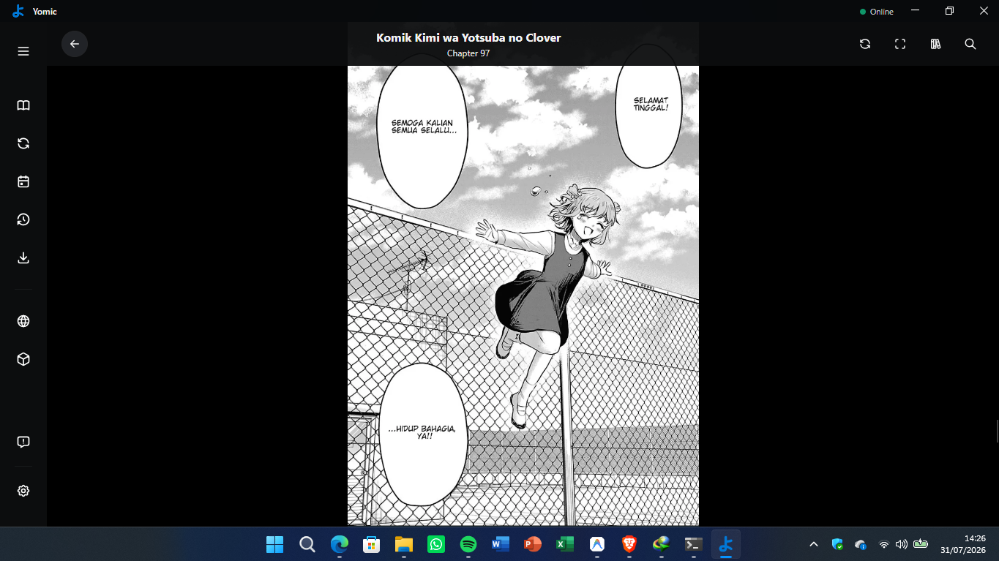
<br/><br/>
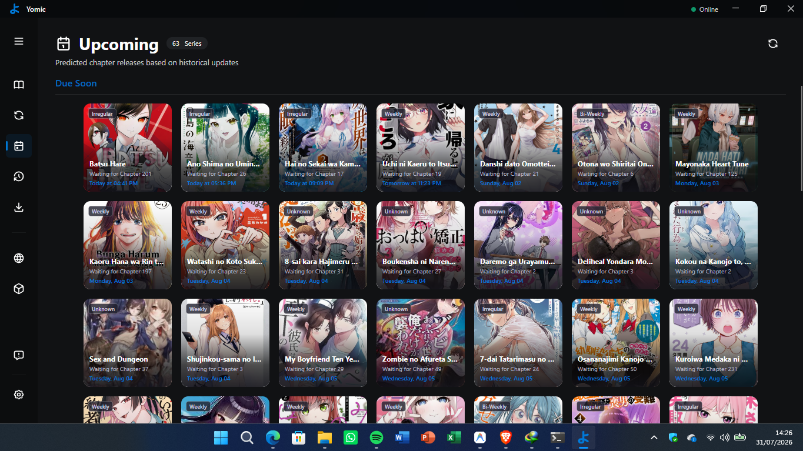
<br/><br/>
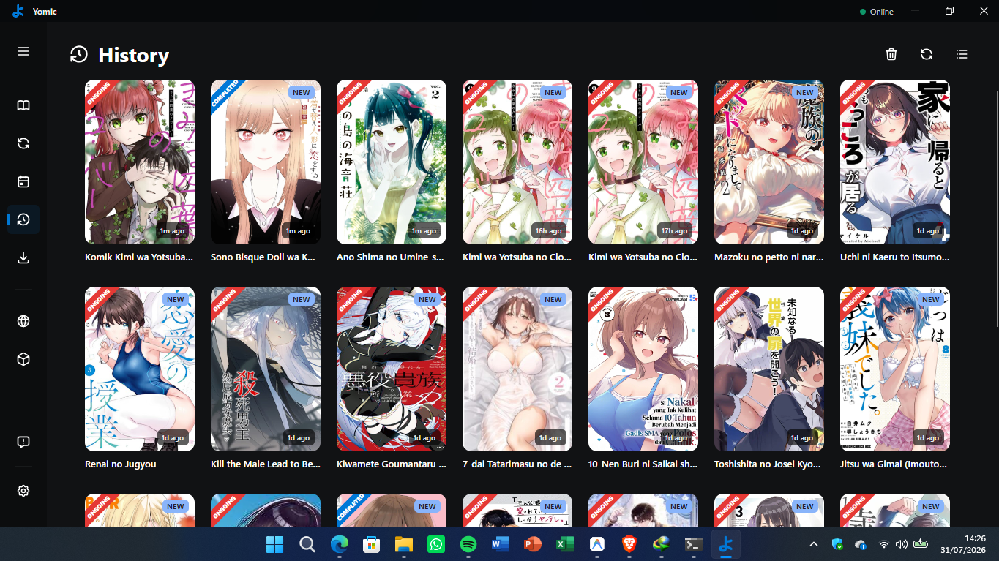
<br/><br/>
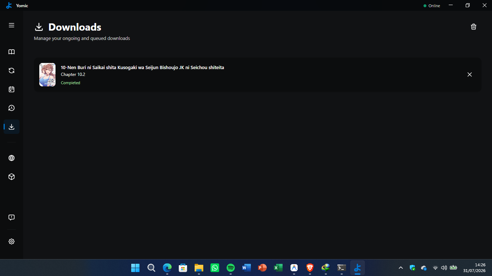
<br/><br/>
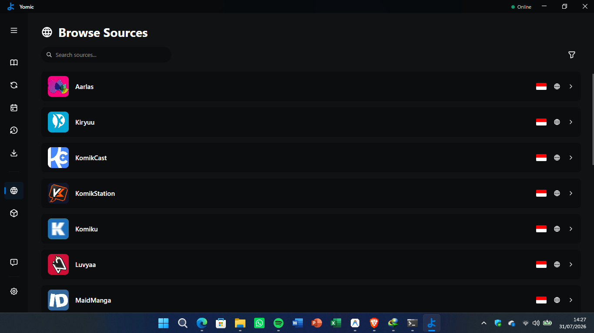
<br/><br/>
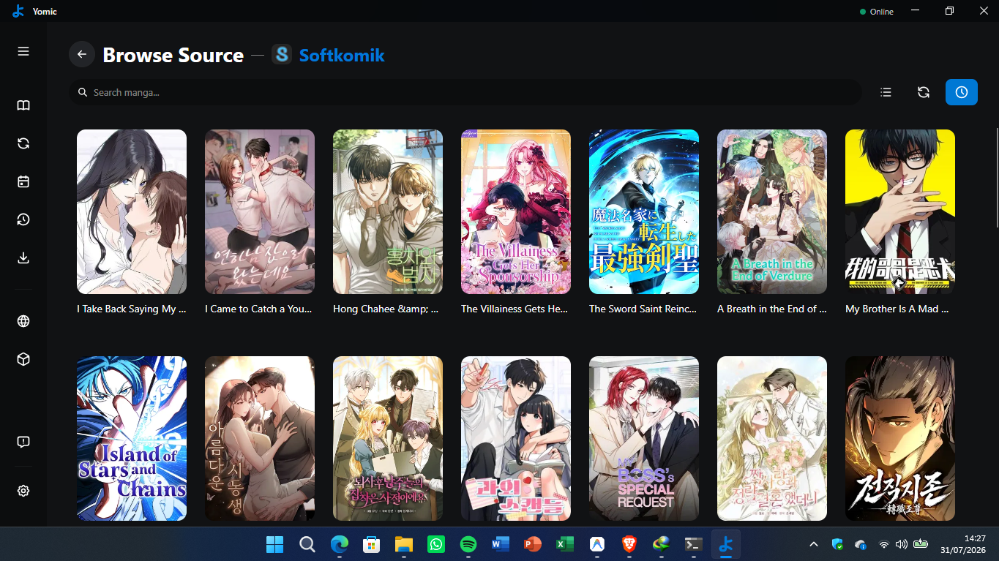
<br/><br/>
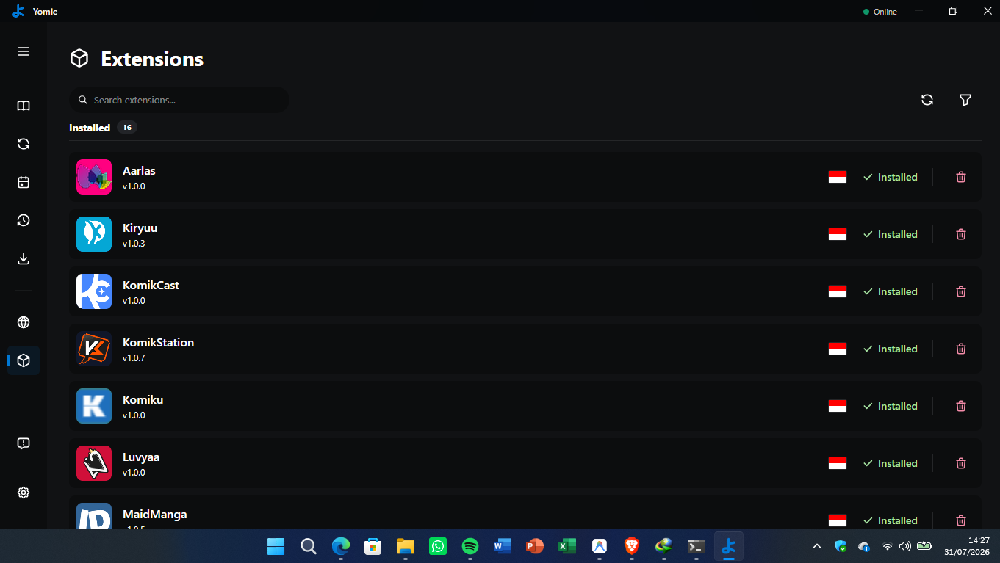
<br/><br/>
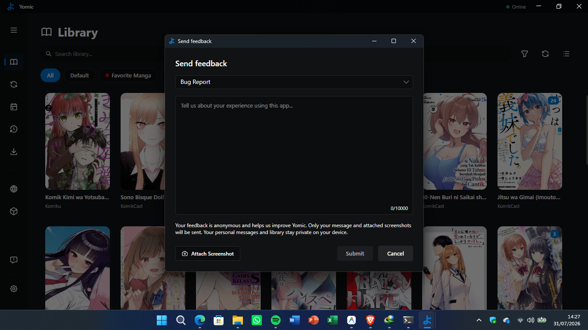
<br/><br/>
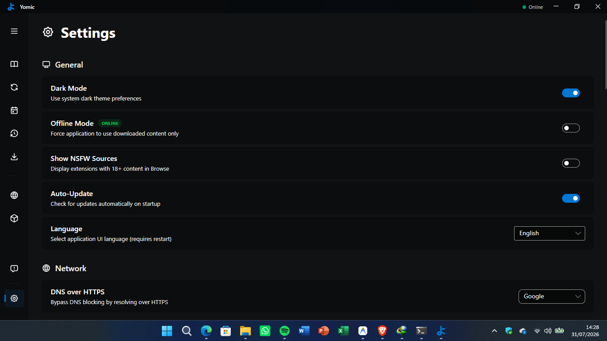

</div>

---

## 📦 Installation

### Requirements
- **Windows 10** or higher (64-bit)
- **.NET Desktop Runtime 10.0** (installed automatically by the setup package)

### Steps
1. Click the **Download Here** button above, or visit the [**Releases Page**](https://github.com/ArisaAkiyama/yomic/releases).
2. Download the latest `Yomic_Setup_vX.X.X.exe` file.
3. Run the installer and follow the on-screen instructions.
4. Open **Yomic** from your Desktop or Start menu.

---

## 🧩 Setting Up Extensions

### Automatic Installation (Recommended)
1. Open **Yomic** and click the **Extensions** tab.
2. Under the **Available** list, choose the sources you want to add.
3. Click the **Download & Install** button — Yomic will download, extract, and register the extension automatically.
4. Go to the **Browse** tab to start exploring comic catalogs.

### Manual / Local Extension Installation
1. Obtain your extension file (`.js` script or `.zip` package).
2. Navigate to the **Extensions** tab in Yomic.
3. Place your file into `%LOCALAPPDATA%\Yomic\Extensions`, or click **Install Local Extension** to pick your file directly.
4. Yomic loads and activates the extension immediately — no restart required.

---

## 🛠️ Building from Source

### Requirements
- **.NET 10.0 SDK**
- **Visual Studio 2022 (v17.12+)** or **VS Code** with C# Dev Kit

```bash
# Clone the repository
git clone https://github.com/ArisaAkiyama/yomic.git
cd yomic

# Build the solution
dotnet build Yomic.sln
```

---

## ⌨️ Keyboard Shortcuts

| Key | Action |
|-----|--------|
| `Right Arrow` | Next Page / Next Chapter (Webtoon) |
| `Left Arrow` | Previous Page / Previous Chapter (Webtoon) |
| `Down Arrow` | Scroll Down |
| `Up Arrow` | Scroll Up |
| `Space` | Scroll Down (Page / Webtoon) |
| `F` / `F11` | Toggle Fullscreen |
| `Esc` | Exit Fullscreen / Close Reader |
| `R` | Rotate Page |
| `H` | Toggle Menu |
| `Ctrl+B` | Bookmark Chapter |
| `+` / `=` | Zoom In |
| `-` | Zoom Out |
| `1` | Switch to Webtoon Mode |
| `2` | Switch to Single Page Mode |
| `3` | Switch to Dual Page Mode |

---

## 🤝 Contributing

Contributions are welcome! Feel free to open issues or submit pull requests to help improve Yomic.

1. Fork the project
2. Create your feature branch (`git checkout -b feature/AmazingFeature`)
3. Commit your changes (`git commit -m 'Add AmazingFeature'`)
4. Push to the branch (`git push origin feature/AmazingFeature`)
5. Open a Pull Request

---

## ⚠️ Disclaimer

The developer(s) of Yomic are not affiliated with any third-party content providers. Yomic is an open-source application designed to browse and view content hosted on public websites through user-installed extensions.

---

## 📄 License

Distributed under the MIT License. See [`LICENSE`](./LICENSE) for more information.

---


